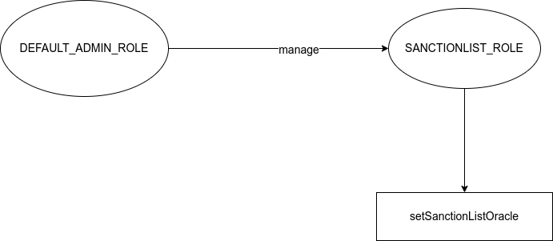

# RuleEngine - Rules

**Rules** is a collection of on-chain compliance and transfer-restriction rules designed for use with the [CMTA RuleEngine](https://github.com/CMTA/RuleEngine) and the [CMTAT token standard](https://github.com/CMTA/CMTAT).

Each rule can be used **standalone**, directly plugged into a CMTAT token, **or** managed collectively via a RuleEngine.

**Status:** *Repository under active development*

## Overview

The **RuleEngine** is an external smart contract that applies transfer restrictions to security tokens such as **CMTAT** or [ERC-3643](https://eips.ethereum.org/EIPS/eip-3643)-compatible tokens through a RuleEngine.
Rules are modular validator contracts that the `RuleEngine` or `CMTAT` compatible token can call on every transfer to ensure regulatory and business-logic compliance.

### Key Concepts

- **Rules are controllers** that validate or modify token transfers.
- They can be applied:
  - Directly on **CMTAT** (no RuleEngine required), **or**
  - Through the **RuleEngine** (for multi-rule orchestration).
- Rules enforce conditions such as:
  - Whitelisting / blacklisting
  - Sanctions checks
  - Multi-party operator-managed lists
  - Conditional approvals
  - Arbitrary compliance logic

## Compatibility

| Component        | Compatible Versions                       |
| ---------------- | ----------------------------------------- |
| **Rules v0.1.0** | CMTAT ≥ v3.0.0<br />RuleEngine v3.0.0-rc0 |

Each Rule implements the interface `IRuleEngine` defined in CMTAT.

This interface declares the ERC-3643 functions `transferred`(read-write) and `canTransfer`(ready-only) with several other functions related to [ERC-1404](https://github.com/ethereum/eips/issues/1404), [ERC-7551](https://ethereum-magicians.org/t/erc-7551-crypto-security-token-smart-contract-interface-ewpg-reworked/25477) and [ERC-3643](https://eips.ethereum.org/EIPS/eip-3643).

### ERC-3643

Each rule implements the following functions from the ERC-3643 `ICompliance`interface

```solidity
function canTransfer(address _from, address _to, uint256 _amount) external view returns (bool);
function transferred(address _from, address _to, uint256 _amount) external;
```

However, contrary to the RuleEngine, the whole interface is currently not implemented (e.g. `created`and `destroyed`) and as a result, the rule can not directly supported ERC-3643 token.

The alternative to use a Rule with an ERC-3643 token is trough the RuleEngine, which implements the whole `ICompliance` interface.

### ERC-721/ERC-1155

To improve compatibility with [ERC-721](https://eips.ethereum.org/EIPS/eip-721) and [ERC-1155](https://eips.ethereum.org/EIPS/eip-1155), the rule implements the interface `IERC7943NonFungibleComplianceExtend` which includes compliance functions with the `tokenId` argument.

While no rules currently apply restriction on the token id, this interface can be used to implement flexible restriction on ERC-721 or ERC-1155 tokens.

```solidity
// IERC7943NonFungibleCompliance interface
// Read-only functions
function canTransfer(address from, address to, uint256 tokenId, uint256 amount)external view returns (bool allowed)

// IERC7943NonFungibleComplianceExtend interface
// Read-only functions
function detectTransferRestriction(address from, address to, uint256 tokenId, uint256 amount)external view returns (uint8 code);
function detectTransferRestrictionFrom(address spender, address from, address to, uint256 tokenId, uint256 value)external view returns (uint8 code);
function canTransferFrom(address spender, address from, address to, uint256 tokenId, uint256 value)external returns (bool allowed);

// State modifying functions (write)
function transferred(address from, address to, uint256 tokenId, uint256 value) external;
function transferred(address spender, address from, address to, uint256 tokenId, uint256 value) external;
```


## Architecture

### Rule - Code list

> It is very important that each rule uses an unique code

Here the list of codes used by the different rules

| Contract                | Constant name                        | Value |
| ----------------------- | ------------------------------------ | ----- |
| All                     | TRANSFER_OK (from CMTAT)             | 0     |
| RuleWhitelist           | CODE_ADDRESS_FROM_NOT_WHITELISTED    | 21    |
|                         | CODE_ADDRESS_TO_NOT_WHITELISTED      | 22    |
|                         | CODE_ADDRESS_SPENDER_NOT_WHITELISTED | 23    |
|                         | Free slot                            | 24-29 |
| RuleSanctionList        | CODE_ADDRESS_FROM_IS_SANCTIONED      | 30    |
|                         | CODE_ADDRESS_TO_IS_SANCTIONED        | 31    |
|                         | CODE_ADDRESS_SPENDER_IS_SANCTIONED   | 32    |
|                         | Free slot                            | 33-35 |
| RuleBlacklist           | CODE_ADDRESS_FROM_IS_BLACKLISTED     | 36    |
|                         | CODE_ADDRESS_TO_IS_BLACKLISTED       | 37    |
|                         | CODE_ADDRESS_SPENDER_IS_BLACKLISTED  | 38    |
|                         | Free slot                            | 39-44 |
| RuleConditionalTransfer | CODE_TRANSFER_REQUEST_NOT_APPROVED   | 45    |
|                         | Free slot                            | 46-50 |

Note: 

- The CMTAT already uses the code 0-6 and the code 7-12 should be left free to allow further additions in the CMTAT.
- If you decide to create your own rules, we encourage you to use code > 100 to leave free the other restriction codes for future rules added in this project.

### Rules as Standalone Compliance Contracts

Every rule implements the minimal interface expected by **CMTAT**, notably:

```solidity
function transferred(address from, address to, uint256 value)
function transferred(address spender, address from, address to, uint256 value)
```

This makes rules directly pluggable into CMTAT without any intermediary RuleEngine.

### Using Rules via RuleEngine

When used through the RuleEngine, a rule must also implement:

```solidity
interface IRule is IRuleEngine {
    function canReturnTransferRestrictionCode(uint8 restrictionCode)
        external
        view
        returns (bool);
}
```

The RuleEngine can then:

- Aggregate multiple rules
- Execute them sequentially on each transfer
- Return restriction codes
- Mutate rule state (operation rules)

#### CMTAT

Each rule can be directly plugged to a CMTAT token similar to a RuleEngine.

Indeed, each rules implements the required interface (`IRuleEngine`) with notably the following function as entrypoint.

```solidity
function transferred(address from,address to,uint256 value)
function transferred(address spender,address from,address to,uint256 value)
```

```solidity
/*
* @title Minimum interface to define a RuleEngine
*/
interface IRuleEngine is IERC1404Extend, IERC7551Compliance,  IERC3643IComplianceContract {
    /**
     *  @notice
     *  Function called whenever tokens are transferred from one wallet to another
     *  @dev 
     *  Must revert if the transfer is invalid
     *  Same name as ERC-3643 but with one supplementary argument `spender`
     *  This function can be used to update state variables of the RuleEngine contract
     *  This function can be called ONLY by the token contract bound to the RuleEngine
     *  @param spender spender address (sender)
     *  @param from token holder address
     *  @param to receiver address
     *  @param value value of tokens involved in the transfer
     */
    function transferred(address spender, address from, address to, uint256 value) external;
}
```


#### RuleEngine

For a RuleEngine, each rule implements also the required entry point similar to CMTAT, and as well some specific interface for the RuleEngine through the implementation of `IRule`interface dfeined in the RuleEngine repository

```solidity
interface IRule is IRuleEngine {
    /**
     * @dev Returns true if the restriction code exists, and false otherwise.
     */
    function canReturnTransferRestrictionCode(
        uint8 restrictionCode
    ) external view returns (bool);
}

```


## Types of Rules

There are two categories of rules: validation rules (Read-only) and operation rules (read-write).

### Validation Rules (Read-Only)

- Cannot modify blockchain state during transfers.
- Used for simple eligibility checks.
- Examples:
  - Whitelist
  - Whitelist Wrapper
  - Blacklist
  - Sanction list (Chainalysis)

### Operation Rules (Read-Write)

- Can update state during transfer calls.
- Example:
  - Conditional Transfer (approval-based)

## Rules details

### Read-only (validation) rule

Currently, there are four validation rules: whitelist, whitelistWrapper, blacklist, and sanctionlist.

#### Whitelist

Only whitelisted addresses may hold or receive tokens.
 Transfers are rejected if:

- `from` is not whitelisted
- `to` is not whitelisted

The rule is read-only: it only checks stored state.

**Example**

During a transfer, this rule, called by the RuleEngine, will check if the address concerned is in the list, applying a read operation on the blockchain.


#### Whitelist wrapper

Allows independent whitelist groups managed by different operators.

- Each operator manages a dedicated whitelist.
- A transfer is allowed only if both addresses belong to *at least one* operator-managed list.
- Enables multi-party compliance


##### Architecture

This rule inherits from `RuleEngineValidationCommon`. Thus the whitelist rules are managed with the same architecture and code than for the ruleEngine. For example, rules are added with the functions `setRules` or `addRule`.


#### Blacklist

Opposite of whitelist:

- Transfer fails if **either** address is blacklisted.


#### Sanction list with Chainalysis

Uses the [Chainalysis](https://www.chainalysis.com/) Oracle to reject transfers involving sanctioned addresses.

- Checks lists for: **US**, **EU**, and **UN** sanctions.
- Documentation: *Chainalysis Oracle for sanctions screening*
- If `from` or `to` is sanctioned, transfer is rejected.

Documentation and the contracts addresses are available here: [Chainalysis oracle for sanctions screening](https://go.chainalysis.com/chainalysis-oracle-docs.html).

**Example**

During a transfer, if either address (from or to) is in the sanction list of the Oracle, the rule will return false, and the transfer will be rejected by the CMTAT.


### Read-Write (Operation) rule

For the moment, there is only one operation rule available: ConditionalTransfer.

#### Conditional transfer

> This rule has been moved to a dedicated repository: [RuleConditionalTransfer](https://github.com/CMTA/RuleConditionalTransfer)

This rule requires that transfers must be approved before being executed by the token holders. During the transfer call, the rule will check if the transfer has been approved. If it has, the approval will be removed since the transfer has been processed, applying a write operation on the blockchain.

This rule requires that transfers be approved by the token holders before being executed.

Initially, this rule was designed to implement a specific requirement in Swiss law (Vinkulierung), but it has since been generalized to be more flexible.

According to Swiss law, if a transfer is not approved or denied within three months, the request is considered approved. This option can be activated by setting the option AUTOMATIC_APPROVAL in the rule.

We have added another option, not required by Swiss law, to automatically perform a transfer if the transfer request is approved. This option can be activated by setting the option AUTOMATIC_TRANSFER in the rule.

Reference: [Taurus - Token Transfer Management: How to Apply Restrictions with CMTAT and ERC-1404](https://www.taurushq.com/blog/token-transfer-management-how-to-apply-restrictions-with-cmtat-and-erc-1404/)


## Access Control

The modules `AccessControlModuleStandalone` allows to implement RBAC access control by  inheriting from the contract `AccessControl`from OpenZeppelin. 

This module overrides the OpenZeppelin function `hasRole`to give by default all the roles to the `admin`.

Each rule implements its own access control by inheriting from the module `AccessControlModuleStandalone`.

For all rules, the default admin is the address put in argument(`admin`) inside the constructor and set when the contract is deployed.

See also [docs.openzeppelin.com - AccessControl](https://docs.openzeppelin.com/contracts/5.x/api/access#AccessControl)

### Address List

Common access control between `blacklistRule`and `WhitelistRule`

Here a schema of the Access Control.


### RuleSanctionList




## Toolchains and Usage

*Explain how it works.*

### Configuration

Here are the settings for [Hardhat](https://hardhat.org) and [Foundry](https://getfoundry.sh).

- `hardhat.config.js`

  - Solidity [v0.8.30](https://docs.soliditylang.org/en/v0.8.30/)
  - EVM version: Prague (Pectra upgrade)
  - Optimizer: true, 200 runs

- `foundry.toml`

  - Solidity [v0.8.30](https://docs.soliditylang.org/en/v0.8.30/)
  - EVM version: Prague (Pectra upgrade)
  - Optimizer: true, 200 runs

- Library

  - Foundry [v1.5.0](https://github.com/foundry-rs/foundry)

  - Forge std [v1.12.0](https://github.com/foundry-rs/forge-std/releases/tag/v1.12.0  )  

  - OpenZeppelin Contracts (submodule) [v5.5.0](https://github.com/OpenZeppelin/openzeppelin-contracts/releases/tag/v5.5.0)

  - CMTAT [v3.0.0](https://github.com/CMTA/CMTAT)

  - RuleEngine [v3.0.0-rc0](https://github.com/CMTA/RuleEngine/releases/tag/v3.0.0-rc0)

### Toolchain installation

The contracts are developed and tested with [Foundry](https://book.getfoundry.sh), a smart contract development toolchain.

To install the Foundry suite, please refer to the official instructions in the [Foundry book](https://book.getfoundry.sh/getting-started/installation).

### Initialization

You must first initialize the submodules, with

```
forge install
```

See also the command's [documentation](https://book.getfoundry.sh/reference/forge/forge-install).

Later you can update all the submodules with:

```
forge update
```

See also the command's [documentation](https://book.getfoundry.sh/reference/forge/forge-update).

#### CMTAT

You also have to install OpenZeppelin inside CMTAT repository (submodule)

```bash
cd CMTAT
npm install
```


### Compilation

The official documentation is available in the Foundry [website](https://book.getfoundry.sh/reference/forge/build-commands) 

```
 forge build
```

### Contract size

```bash
 forge compile --sizes
```

### Testing

You can run the tests with

```bash
forge test
```

To run a specific test, use

```bash
forge test --match-contract <contract name> --match-test <function name>
```

Generate gas report

```bash
forge test --gas-report
```

See also the test framework's [official documentation](https://book.getfoundry.sh/forge/tests), and that of the [test commands](https://book.getfoundry.sh/reference/forge/test-commands).

### Coverage

A code coverage is available in [index.html](./doc/coverage/coverage/index.html).

* Perform a code coverage

```
forge coverage
```

* Generate LCOV report

```
forge coverage --report lcov
```

- Generate `index.html`

```bash
forge coverage --no-match-coverage "(script|mocks|test)" --report lcov && genhtml lcov.info --branch-coverage --output-dir coverage
```

See [Solidity Coverage in VS Code with Foundry](https://mirror.xyz/devanon.eth/RrDvKPnlD-pmpuW7hQeR5wWdVjklrpOgPCOA-PJkWFU) & [Foundry forge coverage](

### Other

Foundry is a blazing fast, portable and modular toolkit for Ethereum application development written in Rust.*

Foundry consists of:

-   **Forge**: Ethereum testing framework (like Truffle, Hardhat and DappTools).
-   **Cast**: Swiss army knife for interacting with EVM smart contracts, sending transactions and getting chain data.
-   **Anvil**: Local Ethereum node, akin to Ganache, Hardhat Network.
-   **Chisel**: Fast, utilitarian, and verbose solidity REPL.

#### Documentation

https://book.getfoundry.sh/

#### Format

```shell
$ forge fmt
```

#### Gas Snapshots

```shell
$ forge snapshot
```

#### Anvil

```shell
$ anvil
```

#### Deploy

```shell
$ forge script script/Counter.s.sol:CounterScript --rpc-url <your_rpc_url> --private-key <your_private_key>
```

#### Cast

```shell
$ cast <subcommand>
```

#### Help

```shell
$ forge --help
$ anvil --help
$ cast --help
```


## API

### IRuleEngine

> Each rule implements the IRuleEngine interface

#### transferred

```
function transferred(address spender, address from, address to, uint256 value)
    external;
```

Called during an ERC-20 token transfer
 Used by rules to update internal state or enforce operation-based restrictions.

##### Parameters

| Name      | Type      | Description                                                  |
| --------- | --------- | ------------------------------------------------------------ |
| `spender` | `address` | Address executing the transfer (owner, operator, or approved). |
| `from`    | `address` | Current token holder.                                        |
| `to`      | `address` | Recipient address.                                           |
| `value`   | `uint256` | Amount transferred.                                          |

------

### IERC1404

#### detectTransferRestriction

```
function detectTransferRestriction(address from, address to, uint256 value)
    external
    view
    returns (uint8);
```

Returns a restriction code describing why a transfer is blocked.

##### Parameters

| Name    | Type      | Description               |
| ------- | --------- | ------------------------- |
| `from`  | `address` | Sender address.           |
| `to`    | `address` | Recipient address.        |
| `value` | `uint256` | Amount being transferred. |

##### Returns

| Name  | Type    | Description                              |
| ----- | ------- | ---------------------------------------- |
| `0`   | `uint8` | Transfer allowed.                        |
| other | `uint8` | Implementation-defined restriction code. |

------

#### messageForTransferRestriction

```
function messageForTransferRestriction(uint8 restrictionCode)
    external
    view
    returns (string memory);
```

Returns a human-readable message associated with a restriction code.

##### Parameters

| Name              | Type    | Description                                               |
| ----------------- | ------- | --------------------------------------------------------- |
| `restrictionCode` | `uint8` | Restriction code returned by `detectTransferRestriction`. |

##### Returns

| Name      | Type     | Description                           |
| --------- | -------- | ------------------------------------- |
| `message` | `string` | Explanation for the restriction code. |

------

### IERC1404Extend

#### REJECTED_CODE_BASE

```
enum REJECTED_CODE_BASE {
    TRANSFER_OK,
    TRANSFER_REJECTED_DEACTIVATED,
    TRANSFER_REJECTED_PAUSED,
    TRANSFER_REJECTED_FROM_FROZEN,
    TRANSFER_REJECTED_TO_FROZEN,
    TRANSFER_REJECTED_SPENDER_FROZEN,
    TRANSFER_REJECTED_FROM_INSUFFICIENT_ACTIVE_BALANCE
}
```

Base transfer restriction codes used by ERC-1404 extensions.

------

#### detectTransferRestrictionFrom

```
function detectTransferRestrictionFrom(
    address spender,
    address from,
    address to,
    uint256 value
)
    external
    view
    returns (uint8);
```

Restriction code for transfers performed by a spender (approved operator).

##### Parameters

| Name      | Type      | Description                      |
| --------- | --------- | -------------------------------- |
| `spender` | `address` | Address performing the transfer. |
| `from`    | `address` | Current token owner.             |
| `to`      | `address` | Recipient address.               |
| `value`   | `uint256` | Transfer amount.                 |

##### Returns

| Name   | Type    | Description                                          |
| ------ | ------- | ---------------------------------------------------- |
| `code` | `uint8` | 0 if transfer allowed, otherwise a restriction code. |

------

### IERC7551Compliance

#### canTransferFrom

```
function canTransferFrom(address spender, address from, address to, uint256 value)
    external
    view
    returns (bool);
```

Determines if a spender-initiated transfer is permitted.

##### Parameters

| Name      | Type      | Description                |
| --------- | --------- | -------------------------- |
| `spender` | `address` | Caller executing transfer. |
| `from`    | `address` | Token owner.               |
| `to`      | `address` | Recipient.                 |
| `value`   | `uint256` | Amount.                    |

##### Returns

| Name      | Type   | Description                   |
| --------- | ------ | ----------------------------- |
| `allowed` | `bool` | `true` if transfer permitted. |

------

### IERC3643ComplianceRead

#### canTransfer

```
function canTransfer(address from, address to, uint256 value)
    external
    view
    returns (bool isValid);
```

Returns whether a transfer is compliant.

##### Parameters

| Name    | Type      | Description      |
| ------- | --------- | ---------------- |
| `from`  | `address` | Sender.          |
| `to`    | `address` | Receiver.        |
| `value` | `uint256` | Transfer amount. |

##### Returns

| Name      | Type   | Description          |
| --------- | ------ | -------------------- |
| `isValid` | `bool` | `true` if compliant. |

------

### IERC3643IComplianceContract

#### transferred

```
function transferred(address from, address to, uint256 value)
    external;
```

Hook invoked during an ERC-20 token transfer.

##### Parameters

| Name    | Type      | Description         |
| ------- | --------- | ------------------- |
| `from`  | `address` | Previous owner.     |
| `to`    | `address` | New owner.          |
| `value` | `uint256` | Amount transferred. |

### Address List Management

> This API is common to whitelist and blacklist rules

#### addAddresses

```
function addAddresses(address[] calldata targetAddresses)
    public
    onlyRole(ADDRESS_LIST_ADD_ROLE)
```

##### Description

Adds multiple addresses to the internal address set.

##### Details

- Does **not** revert if one or more addresses are already listed.
- Restricted to callers holding the `ADDRESS_LIST_ADD_ROLE`.
- Emits an `AddAddresses` event.

##### Parameters

| Name              | Type        | Description                                |
| ----------------- | ----------- | ------------------------------------------ |
| `targetAddresses` | `address[]` | Array of addresses to be added to the set. |

------

#### removeAddresses

```
function removeAddresses(address[] calldata targetAddresses)
    public
    onlyRole(ADDRESS_LIST_REMOVE_ROLE)
```

##### Description

Removes multiple addresses from the internal set.

##### Details

- Does **not** revert if an address is not currently listed.
- Restricted to callers holding the `ADDRESS_LIST_REMOVE_ROLE`.
- Emits a `RemoveAddresses` event.

##### Parameters

| Name              | Type        | Description                       |
| ----------------- | ----------- | --------------------------------- |
| `targetAddresses` | `address[]` | Array of addresses to be removed. |

------

#### addAddress

```
function addAddress(address targetAddress)
    public
    onlyRole(ADDRESS_LIST_ADD_ROLE)
```

##### Description

Adds a **single** address to the set.

##### Details

- **Reverts** if the address is already listed.
- Restricted to callers holding the `ADDRESS_LIST_ADD_ROLE`.
- Emits an `AddAddress` event.

##### Parameters

| Name            | Type      | Description     |
| --------------- | --------- | --------------- |
| `targetAddress` | `address` | Address to add. |

------

#### removeAddress

```
function removeAddress(address targetAddress)
    public
    onlyRole(ADDRESS_LIST_REMOVE_ROLE)
```

##### Description

Removes a **single** address from the set.

##### Details

- **Reverts** if the address is not listed.
- Restricted to callers holding the `ADDRESS_LIST_REMOVE_ROLE`.
- Emits a `RemoveAddress` event.

##### Parameters

| Name            | Type      | Description        |
| --------------- | --------- | ------------------ |
| `targetAddress` | `address` | Address to remove. |

------

#### listedAddressCount

```
function listedAddressCount() public view returns (uint256 count)
```

##### Description

Returns the total number of addresses currently listed in the internal set.

##### Returns

| Name    | Type      | Description                       |
| ------- | --------- | --------------------------------- |
| `count` | `uint256` | Total number of listed addresses. |

------

##### contains

```
function contains(address targetAddress)
    public
    view
    override(IIdentityRegistryContains)
    returns (bool isListed)
```

##### Description

Checks whether a specific address is listed.
 Implements `IIdentityRegistryContains`.

##### Parameters

| Name            | Type      | Description       |
| --------------- | --------- | ----------------- |
| `targetAddress` | `address` | Address to check. |

##### Returns

| Name       | Type   | Description                                         |
| ---------- | ------ | --------------------------------------------------- |
| `isListed` | `bool` | `true` if the address is listed, otherwise `false`. |

------

#### isAddressListed

```
function isAddressListed(address targetAddress)
    public
    view
    returns (bool isListed)
```

##### Description

Returns whether a given address is included in the internal set.

##### Parameters

| Name            | Type      | Description       |
| --------------- | --------- | ----------------- |
| `targetAddress` | `address` | Address to check. |

##### Returns

| Name       | Type   | Description     |
| ---------- | ------ | --------------- |
| `isListed` | `bool` | Listing status. |

------

#### areAddressesListed

```
function areAddressesListed(address[] memory targetAddresses)
    public
    view
    returns (bool[] memory results)
```

##### Description

Checks the listing status of multiple addresses in a single call.

##### Parameters

| Name              | Type        | Description                  |
| ----------------- | ----------- | ---------------------------- |
| `targetAddresses` | `address[]` | Array of addresses to check. |

##### Returns

| Name      | Type     | Description                                         |
| --------- | -------- | --------------------------------------------------- |
| `results` | `bool[]` | Array of boolean listing results, aligned by index. |

#### Details

##### Null address

It is possible to add the null address (0x0) to the blacklist. If it is the case, it will not be possible to mint and burn tokens.

##### Duplicate address

**addAddress**
If the address already exists, the transaction is reverted to save gas.
**addAddresses**
If one of addresses already exist, there is no change for this address. The transaction remains valid (no revert).

##### NonExistent Address

**removeAddress**
If the address does not exist in the whitelist, the transaction is reverted to save gas.
**removeAddresses**
If the address does not exist in the whitelist, there is no change for this address. The transaction remains valid (no revert).


### IERC7943NonFungibleCompliance

Compliance interface for ERC-721 / ERC-1155–style non-fungible assets.
 For ERC-721, `amount` must always be `1`.

------

#### Functions

| Name            | Description                                                  |
| --------------- | ------------------------------------------------------------ |
| **canTransfer** | Verifies whether a transfer is permitted according to the token’s compliance rules. |

------

#### canTransfer

```
function canTransfer(
    address from,
    address to,
    uint256 tokenId,
    uint256 amount
) external view returns (bool allowed)
```

##### Description

Verifies whether a token transfer is permitted according to the rule-based compliance logic.

##### Details

- Must not modify state.
- May enforce checks such as allowlists, blocklists, freezing, transfer limits, regulatory rules.
- Must return `false` if the transfer is not permitted.

##### Parameters

| Name      | Type      | Description                               |
| --------- | --------- | ----------------------------------------- |
| `from`    | `address` | Current token owner.                      |
| `to`      | `address` | Receiving address.                        |
| `tokenId` | `uint256` | Token ID.                                 |
| `amount`  | `uint256` | Transfer amount (always `1` for ERC-721). |

##### Returns

| Name      | Type   | Description                                       |
| --------- | ------ | ------------------------------------------------- |
| `allowed` | `bool` | `true` if transfer is allowed; otherwise `false`. |

------

### IERC7943NonFungibleComplianceExtend

Extended compliance interface for ERC-721 / ERC-1155 non-fungible assets.
 Adds restriction-code reporting, spender-aware checks, and a post-transfer hook.

For ERC-721, `amount` / `value` must always be `1`.

------

#### Functions

| Name                              | Description                                                  |
| --------------------------------- | ------------------------------------------------------------ |
| **detectTransferRestriction**     | Returns a restriction code indicating why a transfer is blocked. |
| **detectTransferRestrictionFrom** | Returns a restriction code for a spender-initiated transfer. |
| **canTransferFrom**               | Checks whether a spender-initiated transfer is allowed.      |
| **transferred**                   | Notifies the compliance engine that a transfer has occurred. |

------

#### detectTransferRestriction

```
function detectTransferRestriction(
    address from,
    address to,
    uint256 tokenId,
    uint256 amount
) external view returns (uint8 code)
```

##### Description

Returns a restriction code describing whether and why a transfer is blocked.

##### Details

- Must not modify state.
- Must return `0` when the transfer is allowed.
- Non-zero codes should follow ERC-1404 or similar standards.

##### Parameters

| Name      | Type      | Description                        |
| --------- | --------- | ---------------------------------- |
| `from`    | `address` | Current token holder.              |
| `to`      | `address` | Receiving address.                 |
| `tokenId` | `uint256` | Token ID.                          |
| `amount`  | `uint256` | Transfer amount (`1` for ERC-721). |

##### Returns

| Name   | Type    | Description                                   |
| ------ | ------- | --------------------------------------------- |
| `code` | `uint8` | `0` if allowed; otherwise a restriction code. |

------

#### detectTransferRestrictionFrom

```
function detectTransferRestrictionFrom(
    address spender,
    address from,
    address to,
    uint256 tokenId,
    uint256 value
) external view returns (uint8 code)
```

##### Description

Returns a restriction code for a transfer initiated by a spender (approved operator or owner).

##### Details

- Must not modify state.
- Must return `0` when the transfer is permitted.

##### Parameters

| Name      | Type      | Description                        |
| --------- | --------- | ---------------------------------- |
| `spender` | `address` | Address performing the transfer.   |
| `from`    | `address` | Current owner.                     |
| `to`      | `address` | Recipient address.                 |
| `tokenId` | `uint256` | Token ID being checked.            |
| `value`   | `uint256` | Transfer amount (`1` for ERC-721). |

##### Returns

| Name   | Type    | Description                                 |
| ------ | ------- | ------------------------------------------- |
| `code` | `uint8` | `0` if allowed; otherwise restriction code. |

------

#### canTransferFrom

```
function canTransferFrom(
    address spender,
    address from,
    address to,
    uint256 tokenId,
    uint256 value
) external view returns (bool allowed)
```

##### Description

Checks whether a spender-initiated transfer is allowed under the compliance rules.

##### Details

- Must not modify state.
- Should internally use `detectTransferRestrictionFrom`.

##### Parameters

| Name      | Type      | Description                              |
| --------- | --------- | ---------------------------------------- |
| `spender` | `address` | Address executing the transfer.          |
| `from`    | `address` | Current owner.                           |
| `to`      | `address` | Recipient.                               |
| `tokenId` | `uint256` | Token ID.                                |
| `value`   | `uint256` | Transfer amount (`1` for ERC-721 token). |

##### Returns

| Name      | Type   | Description                    |
| --------- | ------ | ------------------------------ |
| `allowed` | `bool` | `true` if transfer is allowed. |

------

#### transferred

```
function transferred(
    address spender,
    address from,
    address to,
    uint256 tokenId,
    uint256 value
) external
```

##### Description

Signals to the compliance engine that a transfer has successfully occurred.

##### Details

- May modify compliance state.
- Must be called by the token contract after a successful transfer.
- Must revert if invoked by unauthorized callers.

##### Parameters

| Name      | Type      | Description                              |
| --------- | --------- | ---------------------------------------- |
| `spender` | `address` | Address executing the transfer.          |
| `from`    | `address` | Previous owner.                          |
| `to`      | `address` | New owner.                               |
| `tokenId` | `uint256` | Token transferred.                       |
| `value`   | `uint256` | Transfer amount (`1` for ERC-721 token). |

### RuleSanctionsList

Compliance rule enforcing sanctions-screening for token transfers.
 Integrates a sanctions-oracle (e.g., Chainalysis) to block transfers when the sender, recipient, or spender is sanctioned.

------

#### Constructor

```solidity
constructor(address admin, address forwarderIrrevocable, ISanctionsList sanctionContractOracle_)
```

Initializes access control, meta-transaction forwarder, and optionally the sanctions oracle.

#### setSanctionListOracle

```solidity
function setSanctionListOracle(ISanctionsList sanctionContractOracle_) 
    public 
    virtual 
    onlyRole(SANCTIONLIST_ROLE)
```

Set the sanctions-oracle contract used for transfer-restriction checks.

##### Parameters

| Name                      | Type             | Description                                                  |
| ------------------------- | ---------------- | ------------------------------------------------------------ |
| `sanctionContractOracle_` | `ISanctionsList` | Address of the sanctions-oracle. Passing the zero address disables sanctions checks. |

##### Description

Updates the sanctions-oracle contract reference.
 This function may only be called by accounts granted the `SANCTIONLIST_ROLE`.

Setting the oracle to the zero address is permitted and effectively disables all sanctions-based transfer restrictions.

##### Emits

| Event                            | Description                                           |
| -------------------------------- | ----------------------------------------------------- |
| `SetSanctionListOracle(address)` | Emitted when the sanctions-oracle address is updated. |


## Intellectual property

The code is copyright (c) Capital Market and Technology Association, 2022-2025, and is released under [Mozilla Public License 2.0](https://github.com/CMTA/CMTAT/blob/master/LICENSE.md).
