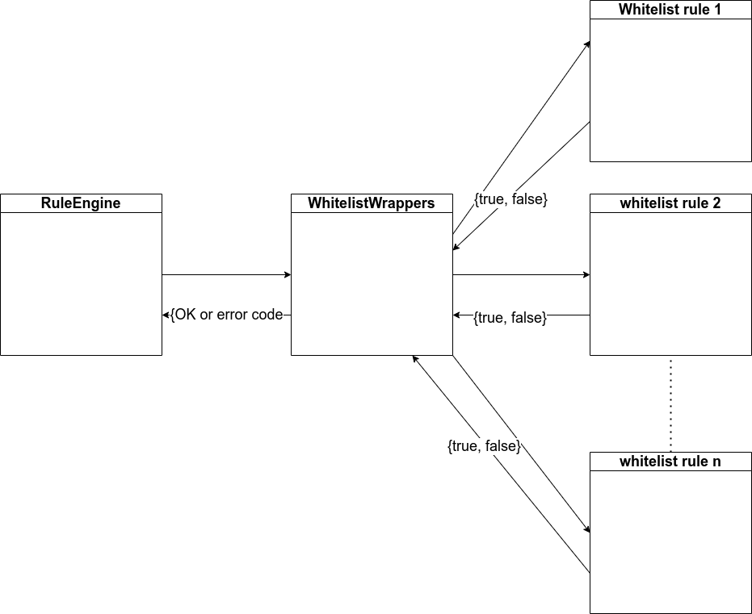
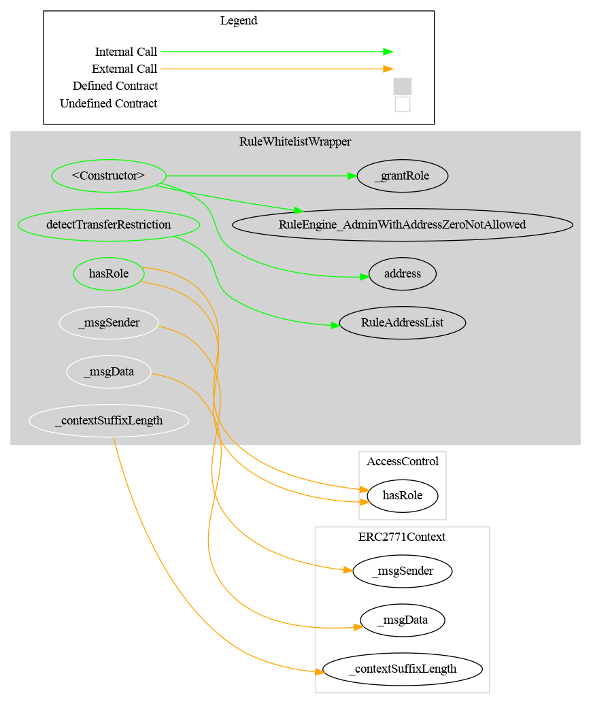
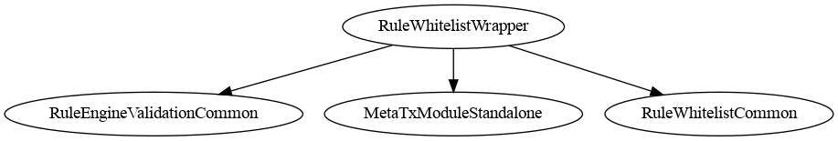

# Rule Whitelist Wrapper

[TOC]

This rule aggregates multiple child whitelist rules using OR logic. An address is considered whitelisted if it appears in **any** of the registered child rules. This enables a multi-operator model where each operator manages their own whitelist independently.

## Architecture

Each child rule must implement `IAddressList` **and must be an allow-list**. The wrapper iterates through all registered rules and returns `true` for an address as soon as one rule lists it. Iteration stops early once all required addresses are resolved.

> ⚠️ **`IAddressList` carries membership, not polarity.** The wrapper reads a child's `areAddressesListed` answer and treats `true` as *eligible*. It has no way to ask whether the child meant "allowed" or "denied", and nothing in `addRule` constrains that — see [Child rules must be allow-lists](#child-rules-must-be-allow-lists).



## Schema

### Graph



### Inheritance



### Flow with a CMTAT token

The sequence below shows how the wrapper aggregates its child whitelist rules when a CMTAT token (with this rule configured in its RuleEngine) processes a transfer.


_Diagram source: doc/img/rule-whitelist-wrapper-flow.puml._

## Configuration

### Constructor parameters

| Parameter | Description |
| --- | --- |
| `admin` | Address granted `DEFAULT_ADMIN_ROLE` (implicitly holds all roles) |
| `forwarderIrrevocable` | ERC-2771 trusted forwarder address for meta-transactions (use `address(0)` to disable) |
| `checkSpender_` | If `true`, spender address in `transferFrom` is also validated against child rules |

### `checkSpender` flag

When enabled, the spender in `transferFrom` must be listed in at least one child rule. Toggled post-deployment by the admin with `setCheckSpender(bool)`.

## Restriction codes

The wrapper reuses restriction codes from the whitelist rule:

| Constant | Code | Meaning |
| --- | --- | --- |
| `CODE_ADDRESS_FROM_NOT_WHITELISTED` | 21 | Sender is not in any child whitelist |
| `CODE_ADDRESS_TO_NOT_WHITELISTED` | 22 | Recipient is not in any child whitelist |
| `CODE_ADDRESS_SPENDER_NOT_WHITELISTED` | 23 | Spender is not in any child whitelist (only when `checkSpender` is enabled) |

## Access Control

| Role | Description |
| --- | --- |
| `DEFAULT_ADMIN_ROLE` | Manages all roles; can call all privileged functions |
| `RULES_MANAGEMENT_ROLE` | May add, remove, or set the list of child whitelist rules |


## Methods

### Child rule management

| Function | Role required | Description |
| --- | --- | --- |
| `setRules(address[] rules_)` | `RULES_MANAGEMENT_ROLE` | Replaces the entire list of child rules |
| `addRule(address rule_)` | `RULES_MANAGEMENT_ROLE` | Adds a single child rule |
| `removeRule(address rule_)` | `RULES_MANAGEMENT_ROLE` | Removes a single child rule |
| `clearRules()` | `RULES_MANAGEMENT_ROLE` | Removes all child rules |

#### Child rules must be allow-lists

**The wrapper cannot tell an allow-list from a deny-list, and adding the wrong one inverts its meaning.**

`IAddressList` expresses only *membership* — "is this address in my set?" — never what membership means. The
wrapper ORs those answers and reads `true` as **eligible**. A `RuleBlacklist` is a perfectly valid `IRule`,
exposes the same `IAddressList` surface, and passes every check `addRule` performs, but its set means the
opposite: listed addresses are the ones that must be **denied**.

Add a `RuleBlacklist` as a child and the wrapper reports its blacklisted addresses as whitelisted. Because the
wrapper is also the token's `isVerified` answer under ERC-3643, `isVerified(blacklistedAddress)` returns `true`
as well.

| Safe as a child | Not a child |
| --- | --- |
| `RuleWhitelist`, `RuleWhitelistOwnable2Step` | `RuleBlacklist` — inverted polarity |
| `RuleReceiverWhitelist`, `RuleReceiverWhitelistOwnable2Step` | `RuleSpenderWhitelist` — its set is spenders, not holders |
| Any custom rule whose listed addresses are the **permitted** ones | Any rule whose `IAddressList` set means something other than "eligible holder" |

**This is now enforced, not merely documented.** It could not be caught by ERC-165 alone — `RuleBlacklist`
advertises the same `IAddressList` ids as the whitelist rules, because `IAddressList` describes *membership* and
both kinds of list have members. The fix is the separate marker interface that observation implies:
[`IAddressListPolarity`](#child-rules-are-erc-165-checked) adds a single `isAllowList()` function, the wrapper
requires it and refuses any child answering `false`. Pinned by `test_WW2_DenyListChildIsRejectedAtAddRule`.

#### Children are ERC-165-checked

`addRule` and `setRules` both route through `_checkRule`, which requires the candidate to advertise
**`IAddressListBatchQuery`** via ERC-165, on top of the inherited non-zero and not-already-present checks. A
candidate that does not is rejected with `RuleWhitelistWrapper_ChildIsNotAnAddressList(rule)`.

This closes the failure where a valid `IRule` that is not an address list — `RuleMaxTotalSupply`, say — was
accepted and then reverted the blind `areAddressesListed` call during a transfer. The early exit in the child
scan made that *input-dependent*: an address pair already resolved by an earlier child still worked, so the
wrapper looked healthy right up until a pair that needed the full scan (audit `F-5`, Nethermind AuditAgent
`NM-18`). It also refuses a **nested wrapper**, which does not implement `areAddressesListed` and would brick the
parent the same way.

`ERC165Checker.supportsInterface` is itself non-reverting — a bounded staticcall returning `false` for a codeless
address, a missing selector or malformed return data — so a hostile candidate cannot brick the setter that is
screening it.

##### Two questions, two interfaces

Membership and meaning are different questions, so the guard asks both:

| Requirement | Interface | Failure |
| --- | --- | --- |
| Can you answer "is this address listed?" | `IAddressListBatchQuery` (`0x20e8e17a`) | `RuleWhitelistWrapper_ChildIsNotAnAddressList` |
| Do you declare what membership *means*? | `IAddressListPolarity` (`0xdc4efe10`) | `RuleWhitelistWrapper_ChildDoesNotDeclarePolarity` |
| Does it mean **allowed**? | `isAllowList() == true` | `RuleWhitelistWrapper_ChildIsNotAnAllowList` |

**Absence of the polarity declaration is a refusal, never an assumed allow-list.** That is the only reading that
fails closed for a contract predating the interface or deliberately declining it.

What each rule declares:

| Rule | `isAllowList()` | As a wrapper child |
| --- | --- | --- |
| `RuleWhitelist` | `true` | ✅ accepted |
| `RuleReceiverWhitelist` | `true` | ✅ accepted |
| `RuleBlacklist` | `false` | ❌ rejected — deny-list |
| `RuleSpenderWhitelist` | *does not implement the interface* | ❌ rejected — see below |
| `RuleWhitelistWrapper` (nested) | *does not implement `areAddressesListed`* | ❌ rejected at the first check |

`RuleSpenderWhitelist` **deliberately abstains, and must not be "fixed" to declare `true`.** Its set genuinely is
an allow-list, so `true` would be honest about polarity and still wrong: the listed addresses are permitted
*spenders*, not permitted *holders*, and the wrapper would read them as eligible transfer participants. Polarity
is only half the question; the other half is what the addresses are. Withholding the declaration is what makes
the fail-closed check refuse it — pinned by `test_WW2_ChildDecliningToDeclarePolarityIsRejected`.

##### Wrappers cannot nest, deliberately

A `RuleWhitelistWrapper` does not implement `areAddressesListed`, so it fails the first check and cannot be a
child of another wrapper. That is a decision, not an omission (Nethermind AuditAgent `NM-19`, declined).

**Nesting would buy no expressive power.** The wrapper is an OR, and `OR(OR(a,b), OR(c,d))` ≡ `OR(a,b,c,d)` — an
OR nested in an OR flattens. Every policy a nested wrapper could express is expressible with a flat child list,
and the composition integrators actually reach for is already available one level up:

| Composition | How |
| --- | --- |
| **OR** of lists | one wrapper, flat children |
| **AND** of ORs | several wrappers in the `RuleEngine`, which returns the first non-zero code |
| OR of ORs | identical to a flat wrapper |

It would also cost. The scan is [~8.8k gas per child](#gas-cost-of-the-child-rule-scan) and the *rejected* path
never early-exits, so a 10 × 10 nest costs **~880k gas per transfer** where the equivalent flat wrapper costs
**~90k** — the same policy at ten times the price, paid by every transferring holder. And it would open a cycle
class (`A → B → A`) that recurses to out-of-gas, bricking transfers *and* `isVerified`, with no cheap on-chain
defence.

Delegated administration — the real motivation — already works flat: see the [usage scenario](#usage-scenario),
where three operators each manage their own `RuleWhitelist` under one wrapper.

##### Why the check asks for a sub-interface, not all of `IAddressList`

The wrapper calls **one** function on its children:

```solidity
bool[] memory isListed = IAddressListBatchQuery(rule(i)).areAddressesListed(targetAddress);
```

`IAddressList` declares eight (`addAddress`, `removeAddress`, `addAddresses`, `removeAddresses`,
`listedAddressCount`, `isAddressListed`, `areAddressesListed`, and `contains` inherited from
`IIdentityRegistryContains`). Requiring the full id would demand seven functions the wrapper never touches —
including all four **write** functions, which a read-only aggregating child has no reason to expose — and reject
an otherwise perfectly serviceable child. An ERC-165 check should ask for what is actually called.

`IAddressListBatchQuery` therefore declares `areAddressesListed` alone, and `IAddressList` inherits it:

| Constant | Value | Covers |
| --- | --- | --- |
| `IADDRESS_LIST_BATCH_QUERY_INTERFACE_ID` | `0x20e8e17a` | `areAddressesListed(address[])` — **what the wrapper requires** |
| `IADDRESS_LIST_INTERFACE_ID` | `0x5d10e182` | the full eight-selector hierarchy |

Factoring the selector into a parent left the flattened set unchanged, so `0x5d10e182` keeps its value and every
rule advertises both ids. The sub-interface id is safe to state as a literal, unlike the full one: it declares a
single function and inherits nothing, so there is no omitted-parent trap. All of this is asserted in
`test/InterfaceId/AddressListInterfaceId.t.sol`.

This is a category error by a trusted role rather than an attack — the same role can already remove every child
outright, which fails closed — but it fails **open**, silently, so it is worth checking at configuration time and
in any deployment review. Reported as Nethermind AuditAgent `NM-20`.

### `setCheckSpender(bool value)`

Enables or disables spender checks. Restricted to `DEFAULT_ADMIN_ROLE`.

### `isVerified(address targetAddress) → bool`

Returns `true` if the address is listed in at least one child rule. This is the ERC-3643 eligibility answer, and
it resolves through the same child scan as the transfer check, so the two can never disagree about an address —
including when a child's polarity is wrong (see [Child rules must be allow-lists](#child-rules-must-be-allow-lists)).

### `rule(uint256 index) → address`

Returns the child rule at the given index.

### `rulesCount() → uint256`

Returns the number of registered child rules.

## Gas cost of the child-rule scan

`_detectTransferRestrictionForTargets` makes **one external `STATICCALL` per child rule**:

```solidity
uint256 unresolved = targetsLength;
for (uint256 i = 0; i < rulesLength; ++i) {
    bool[] memory isListed = IAddressList(rule(i)).areAddressesListed(targetAddress);  // <- external call
    for (uint256 j = 0; j < targetsLength; ++j) {
        if (isListed[j] && !result[j]) { result[j] = true; --unresolved; }
    }
    // early exit: stop as soon as EVERY target address has been resolved
    if (unresolved == 0) { break; }
}
```

The early-exit test is a single comparison against a counter maintained as targets are resolved. It
was previously a full rescan of `result` on every child rule; the counter form is equivalent and
saves roughly **85 gas per child scanned** (~1% of the per-child cost). The external `STATICCALL`
dominates, so the table below is essentially unchanged by it. Treat those figures as a marginally
conservative upper bound.

**This is not only a `view` cost.** The wrapper's `transferred()` → `_detectTransferRestriction` path runs the same scan during **transfer execution**, so the gas is paid by the *transferring user*, on every transfer, for the life of the token.

### Measured cost

The scan is **linear** in the number of children actually scanned, at a marginal cost of **~8.8k gas per child** (`detectTransferRestriction`, 2 target addresses). Measured:

| Children | Allowed pair, resolved only by the **last** child | Rejected pair (**never** early-exits) | Marginal gas/child |
| --- | --- | --- | --- |
| 1 | ~7.0k | ~10.7k | — |
| 5 | ~42.3k | ~46.0k | ~8.8k |
| 10 (the default cap) | ~86.4k | ~90.0k | ~9.0k |
| 25 | — | ~222.3k | ~8.9k |
| 50 | — | ~442.8k | ~8.9k |
| 100 | — | ~884.2k | ~8.8k |
| 200 | — | ~1.77M | ~8.8k |

The marginal cost stays flat (8,891 → 8,855 → 8,841 → 8,841 gas/child from n=25 to n=200), so memory expansion is negligible at any realistic child count and the model `gas ≈ N × 8.8k` holds.

With `checkSpender = true` (3 target addresses instead of 2), the same 10-child wrapper costs **~116k** (allowed) to **~121k** (rejected).

**This is a cost problem, not a liveness problem.** Even 200 children (~1.77M gas) is only ~6% of a 30M block; a transfer would not fail to fit until roughly **3,400 children**. Long before that, the wrapper simply makes every transfer economically painful. Treat the numbers above as a per-holder tax, not as a safety cliff.

### Two things make the worst case the common case

1. **The early exit only fires once *every* target address is resolved.** A transfer that is going to be **rejected** (because `from`, `to` or `spender` is in *no* child list) never resolves, and therefore scans **all N children**. The most expensive path is the failing one, and the user pays for it before the revert.
2. **`checkSpender = true` adds a third address that must also be found** before the loop can break. It materially lowers the early-exit hit rate and pushes more transfers toward the full-N scan (≈ +35% at 10 children, per the table above).

### Operator guidance

- **Keep the child list small: stay at or below the default cap of 10.** `addRule` reverts once `rulesCount() >= maxRules`, and `maxRules` defaults to `DEFAULT_MAX_RULES = 10`. At that cap the worst case is ~90k gas of scanning per transfer: significant, but safe.
- **Raising `maxRules` is a decision with a permanent, per-transfer cost for every holder.** `setMaxRules` only rejects `0`; it accepts any other value. A rules manager who raises the cap to 100 makes the worst-case scan cost **~884k gas on every transfer**; at 200 it is ~1.77M. That is a tax on holders, not a broken token — transfers still fit in a block — but it is paid forever and cannot be refunded. Nothing untrusted can trigger this: only `RULES_MANAGEMENT_ROLE` (or the owner) can add child rules or raise the cap. **The size of the child list is the operator's responsibility.**
- **Order children by expected hit rate.** Put the whitelist that resolves the most addresses first, so the early exit fires as early as possible. This is free and materially reduces the average cost.
- **Prefer fewer, larger child lists over many small ones.** The per-child overhead is an external call; the number of addresses inside a child does not affect the scan cost.

## Notes

### Usage scenario

Three operators (A, B, C) each manage their own `RuleWhitelist`. The `RuleWhitelistWrapper` is configured with all three as child rules. A transfer between any two addresses whitelisted by any one of the operators will pass. The wrapper admin grants `RULES_MANAGEMENT_ROLE` to a coordinator who adds and removes child rules as operators join or leave.
